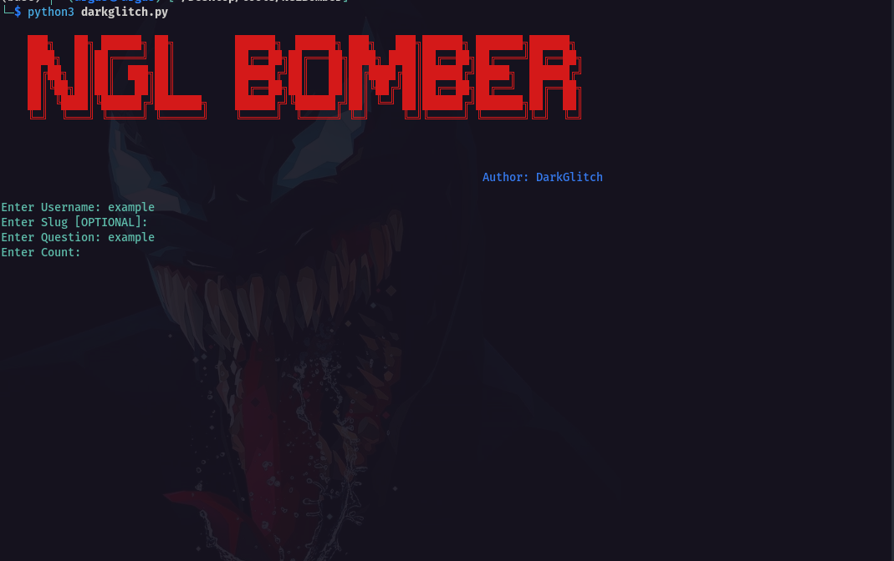

# NGL Bomber

## 📌 Purpose

This project is a simple Python command-line tool that sends messages to an NGL username using their public API.

It is mainly built for learning purposes to understand:
- HTTP requests with `requests`
- CLI input handling in Python
- Basic automation structure

---

## ⚙️ Features

- Send messages to an NGL username
- Optional support for **slug** (example: `confessions`)
- Send multiple messages using a count value
- Random `deviceId` generation (UUID)
- Simple modular structure:
  - `darkglitch.py` → entry point
  - `view.py` → user input handling
  - `services.py` → API request logic
  - `banner.py` → CLI banner

---

## 🚀 How to Use

### 1. Clone this repository
```bash
git clone https://github.com/LaVenganzaDelLadron/NGLBomber.git
cd NGLBomber
```

### 2. Install dependencies
```bash
pip install requests colorama
```

### 2. Run the program
```bash
python3 darkglitch.py
```

### 3. Enter required inputs
```text
Enter Username: <NGL username>
Enter Slug [OPTIONAL]: <confessions / leave empty>
Enter Question: <your message>
Enter Count: <number of messages>
```

### 📤 OUTPUT
if successful
```text
MESSAGE SENT
MESSAGE SENT
MESSAGE SENT
```
if failed
```text
USERNAME IS NOT EXIST
```



### ⚠️ Disclaimer
This tool interacts with a third-party service (NGL API).
Excessive usage may lead to rate limits or blocked requests.
Use responsibly and only for educational purposes.
